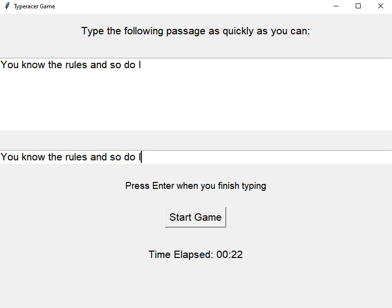

# Simple Python Typing Game

Welcome to my Simple Python Typing Game! This game challenges you to type a passage of text as quickly and accurately as possible. Track your typing speed and accuracy with real-time feedback and enjoy background music while you play.

<div align="center">
    
</div>

## Features

- **Random Passages:** Test your typing skills with different passages.
- **Real-Time Feedback:** See your typed text color-coded as you type.
- **Typing Metrics:** Get feedback on time taken, accuracy, and words per minute (WPM).
- **Background Music:** Play your game with relaxing background music.
- **Record-Keeping:** Track and view your past game results.

## Requirements

- **Python 3.12**
- **Pygame** (for background music)

## Installation

To set up and play the Typing Game locally, follow these steps:

### 1. Clone the Repository

First, clone the repository to your local machine:

```bash
git clone https://github.com/mxrky4/Simple_Python_Typeracer.git
cd Simple_Python_Typeracer
```

### 2. Install Dependencies
Make sure you have Python 3 installed. Then, install the required Python libraries:

```bash
pip install pygame
```
### 3. Download Music File
Download the music file (Pure Imagination - Lofi Cover.mp3) and place it in the same directory as your Python script. Ensure the file name matches exactly or update the filename in the code accordingly.

### 4. Run the Game
Execute the Python script to start the game:

```bash
python typeracer.py
```
The game window should appear, allowing you to start playing.

### How to Play
Click "Start Game" to begin.
Type the provided passage as quickly and accurately as possible.
Press "Enter" when you finish typing to submit.
View your results, including time taken, accuracy, and typing speed.
Decide whether to play again or exit.


### Troubleshooting
Music Not Playing: Ensure the music file is correctly placed and named. Check for any error messages in the terminal related to Pygame.
Library Issues: Verify that Pygame is installed properly. You can reinstall it using pip.

### Play Online
You can also play the game directly on Itch.io. Enjoy the game online without needing to download anything!
[Itch.io](https://mxrkydev.itch.io/simple-python-typeracer)
